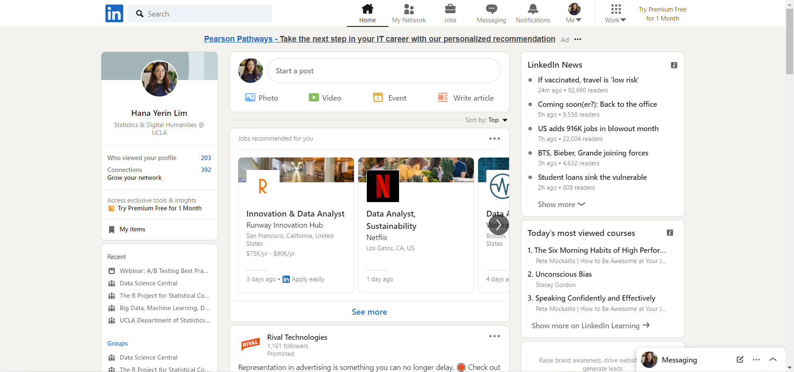
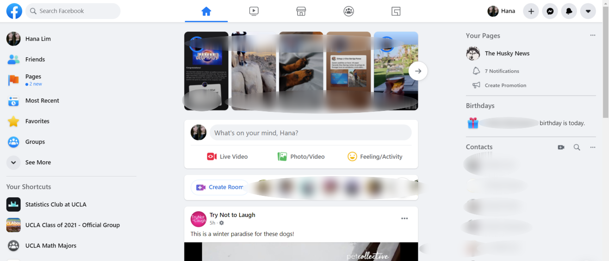

# Heuristic Evaluation of LinkedIn and Facebook 
## Spring 2021 DH 110 - User Experience and Design 
### Hana Yerin Lim 

## Description
I decided to explore the user experience side of LinkedIn and Facebook because they are some of the most used among younger generations (millennials and Gen-Z). Although LinkedIn and Facebook are some of the most popular websites used by billions of people, users might experience some discomforts using them. LinkedIn is perhaps the most well-known employment-oriented online platform that provides users to find employment, extend their networks, and learn new materials. I believe I use LinkedIn just as much as other people to seek opportunities, but I've recently been experiencing inconvenience using it. There might be no major problem with the Facebook design since everyone just accepts the change and uses it on the daily basis, users might feel some components are cluttered and messy with overloading pictures and navigation tools. I chose these sites to pinpoint some of the issues and discuss possible improvements. 

User Demographics source: https://www.statista.com/statistics/273505/global-linkedin-age-group/
https://sproutsocial.com/insights/facebook-stats-for-marketers/

## Severity Ratings in Heuristic Evaluation 
Source: [Nielson Norman Group](https://www.nngroup.com/articles/how-to-rate-the-severity-of-usability-problems/)
|Rating|Description|
|:---:|----------------------------------------------------------------------------------|
|1	|Cosmetic problem only: need not be fixed unless extra time is available on project|
|2	|Minor usability problem: fixing this should be given low priority|
|3	|Major usability problem: important to fix, so should be given high priority|

## Website 1: LinkedIn 
### Information about LinkedIn webpage 
https://www.linkedin.com/

LinkedIn is an American business and employment-oriented online service that operates via websites and mobile apps. Launched on May 5, 2003, the platform is mainly used for professional networking and allows job seekers to post their CVs and employers to post jobs.

Overall Evaluation: Besides some of the strengths with the user experience components, The most critical problem with LinkedIn is the amount of error occurring more than half of the time when using the product. This bug needs to be fixed as soon as possible because no content nor a bad connection is the cause of the error. Another minor issue would be the inflexibility of withdrawing/undoing submitted applications. Some other competitive websites do have options to withdraw from the job position, which users might find helpful if they want to make any changes. Updates on the application process would be very helpful as the number of them is not shown. In addition to these major and minor points, more is discussed in the following table.

### Heuristic Evaluation of LinkedIn 
|Heuristic Description|Severity Rating|Heuristic Evaluation|Possible Solution for Ranks 2, 3|
|:---------------------:|:-----------:|--------------------|----------------------|
|Visibility of system status|2|LinkedIn could do a better job, though, on showing the visibility of system status after submitting the applications because I've seen other companies having transparent application progress. Most of the time, the application progress is not updated, but I do understand that it could be hard to track down all millions of applications from a lot of companies. The alternative method of getting updates is via email directly from the companies. However, I said it to be a minor issue because a lot of my applications go into the junk. | Make sure the application process is synced with each company. 
|Match between system and real world|1|In terms of the match between the system and the real world, LinkedIn uses beginner-friendly terms so that every age group can understand the website terms and navigate pretty easily. | -|
|User control and freedom|2|There is a reaction button for each post, and it is pretty easy to redo and undo the reaction stickers. However, when messaging, there is no option to undo sending a message, even if it is sent accidentally. Another point is that once I submit my application, there is no option to withdraw. One of the competing platforms is called Handshake and has an option to withdraw from an application.|Make an option to undo or delete the sent message. This may allow the prevention of miscommunciation/misunderstanding and increases user control and freedom. |
|Consistency and standards|1|I believe LinkedIn is pretty consistent with the design and keeps the standard. I expect the logo to be on the topleft of the website, and I have the navigation bar on the top as I expected. It is pretty easy to navigate through different places. |-|
|Error prevention|1| Although LinkedIn doesn't have a feature of a pop-up error making sure the user has everything ready to go, users can edit their errors and frequently update their posts and profiles. When submitting the application, there is a review section to go over my whole application in the end so this has been helpful for the users. |-|
|Recognition rather than recall|2|LinkedIn doesn't specifically have options to choose tags (interests/industry), but it has the search bar to put in a specific keywords that the users are interested. | Possible suggestion is to have an interest selection page in the beginning of the creation of LinkedIn profile. There may be a separate page for the taglists so that the user can easily change the preference/interest tags whenever possible. 
|Flexibility and efficiency of use|1| I believe it is efficient for users when using LinkedIn because on top of the basic features, there are filter buttons to do advanced searched. |-|
|Aesthetic and minimalist design|1| Although LinkedIn doesn't have the best design and indeed not that minimalistic, I understand that this website needs many information presented as possible. I think it needs not be fixed unless it is worth their time and effort. |-|
|Help users recognize, diagnose, and recover from errors|3|The biggest point with using LinkedIn is getting way too frequent error whenever I try to navigate to a different page. It has been quite a while since I've been getting errors like "Couldn't find the page request", and this always frustrated me as I had to refresh page a couple of times. Since I'm not getting any similar types of error on other websites, I believe it is the unique error from LinkedIn, and it is a major problem that their tech team has to fix as soon as possible. |Possible Solution is to connect with the software engineers to discuss this major issue and to minimize errors as much as possible. 
|Help and documentation|1| LinkedIn has a separate help page with a lot of the common questions on the left side of the page. There is also a search section we can type in specific question. So far, I haven't had any questions using LinkedIn. |-|

## Website 2: Facebook 
### Information about Facebook webpage 
https://www.facebook.com/

Facebook is a popular global social networking service that is considered one of the Big Five companies in the U.S. Facebook has quite a lot of features but its main features are the Newsfeed where the user see contents from his Facebook friends and pages he follows; Messenger for messaging; Timeline where it shows the user's information and content posted or shared; the Wall, a space for the user's content; and Events where user can see events related to him or his Facebook friends like birthdays or social gatherings.

Overall Evaluation: Some of the problems with Facebook's usability design is repetition, consistency, and recognition. Some tabs exist in several places from multiple navigation bars that ends up navigating to the same page. (ex: "group" can be found on the left navigation bar, top navigation bar, and a plus dropdown menu on the topright corner.) In my opinion, I think Facebook needs to work on improving recommendation metrics. Facebook doesn't have a taglist that the users can choose to read or watch about certain topics. What I noticed is that whenever my friend tags me on a certain video, Facebook keeps recommends me the similar types of video that I am not interested to see. Although there is an option to stop suggesting this type of video, it somehow keeps poping up in my newsfeed as a suggested video. More is discussed in the following table. 

### Heuristic Evaluation of Facebook  
|Heuristic Description|Severity Rating|Heuristic Evaluation|Possible Solution for Ranks 2, 3|
|:---------------------:|:-----------:|--------------------|----------------------|
|Visibility of system status|1|Facebook does a good job in terms of making the system status transparent. Users are able to track the system processing from the bar that pops up before the post. |-|
|Match between system and real world|1|In terms of the match between system and real world, Facebook does a good job with matching between system and the real world term usages. The terminologies are user-friendly so every age groups can easily understand the website terms and navigate pretty smoothly. |-|
|User control and freedom|1| Users are able to make the edits on their posts and even messages. Even if the users already sent out a message, there is an option that can delete from both ends, which is very flexible to users. |-|
|Consistency and standards|2|Social medias like facebook oftentimes change the whole design of the websites/apps, which can make users a bit confused on finding certain tabs. Since Facebook is adding so many components, there are a lot of repetition. For example, a user can post from a notification (home) page, but there is another section on the top right corner to make a post. On the left side, there are more than 30 tabs, which some of them are repeatedly showing on the other navigation menus. A couple of years ago, I remember spending too much time to find a specific topic from settings and barely finding it. |Possible suggestion is to remove some of the redundant tabs under the naviation bar to make the page less cluttered. Simple design would be very effective. 
|Error prevention|1|Facebook does a great job on error prevention because users can delete the sent message, which is similar to undo function in gmail. The users also are allowed to edit the post whenever necessary. |-|
|Recognition rather than recall|3|Facebook doesn't have a separate taglist for users to pick, but rather has its own recommendation system behind the scene. For example, this system introduces new videos in relation to the previous videos the users watched. The previous videos could've been watch by friends' recommendation, a randomly suggested video, or an interest at that time. The users can change their interests and therefore would want to explore different types of videos, but although there is an option to not see similar types of video, it keeps popping up in the newsfeed. | Possible solution is to have a tagslist so that users can see the posts that are related to their interests. There can be a separate page for a tagslist so that the users can change it at anytime.|
|Flexibility and efficiency of use|2|Facebook setting design is kind of confusing. Instead of having every settings related options in one page, some of the privacy option might lead to another page, which could make users a bit confused. But other than time consumption, it does have advanced settings. | Instead of having multiple help pages, combine everything into one page so that it is easier for the users to find the option. 
|Aesthetic and minimalist design|2|The design of Facebook is definitely far off from Google's minimalistic design. The recent Facebook design is a bit messy and overwhelming as there are too many supplements (ex: Marketplace, Gaming Video, Movies, and so much more) |Possible solution is to reduce some of the redundant components so that the page look less messy. If the navigation bar has to exist somehow, then a button might help so that the users can click on it whenever they need it. 
|Help users recognize, diagnose, and recover from errors|1| Facebook does a good job in terms of error occurance as there are barely any errors that occur using Facebook. There is a troubleshooting page to solve some of the errors. |-|
|Help and documentation|1| Facebook has a separate help page with a lot of the common questions on the left side of the page. There is also a search section we can type in specific question. |-|
