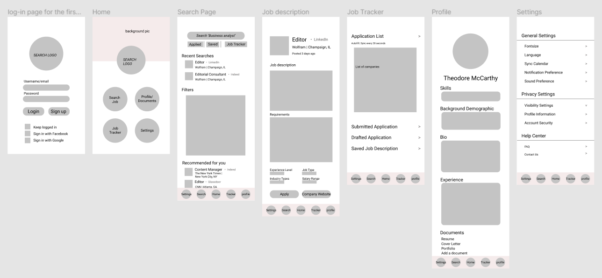
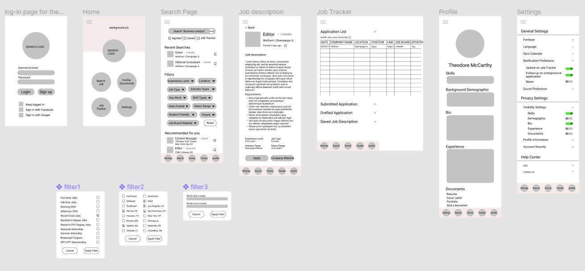
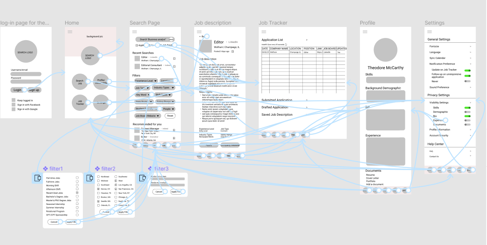
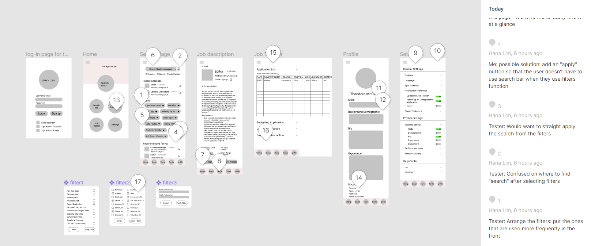
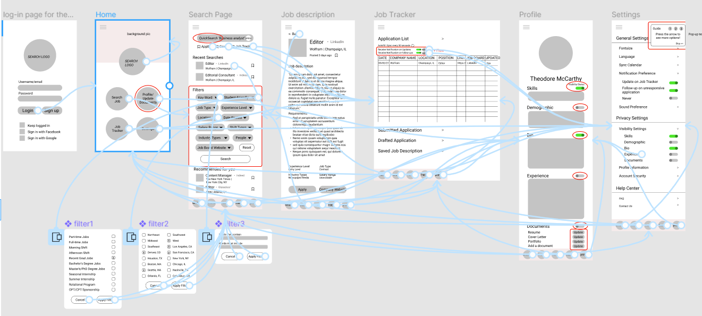

# Assignment 05: Low Fidelity Prototype
## DH 110 | Hana Yerin Lim 

## Description of the Project 
**Purpose:**

Rather than focusing on the aesthetic side of the product, the purpose of the low-fidelity prototype is to test the functionality and the flow of the features and to check if the features are tailored to the user's needs. 

**User research + Persona + Three features:**

Through usability testing of the existing job board (LinkedIn), contextual inquiry of a targeted user, user persona exercise, and insight from my personal experience, I created a low-fidelity prototype with significant features to perform the given tasks.
The current project aims to create a job tracker that lists the companies applied in a spreadsheet format and to allow the user to access the job postings from a system rather than from many different job boards. The goal is to increase the user's efficiency and management with job hunting to prevent the user from being overwhelmed and confused with loads of job applications and job postings from different websites. The targeted community is all the job seekers (all age range but with a very few age groups less than 18-year-old). According to the previous usability test and the interview, people from the targeted community are not too satisfied and seek improvement with the current methods of job boards. After gathering insights from previous testings, these are the features that can mitigate the dissatisfaction and be geared towards a significant improvement. 

1. Advanced filters - More specified filters that include more options for location (ex: west, south-west, east, etc), students (position for student/non-student), title and description (flexible and more advanced ways of including certain words). A platform that unites all the job board websites' job postings into this app/website so the user can get the latest and earliest possible updates
2. Personalized record - The automated list of the companies users applied organized and managed from the system; users can always come back to this list and refresh their memories on job descriptions or the date they applied
3. Follow-up Notification on application: If the company hasn't responded after a month, users receive a notification and can choose different possible options: either cold email the companies or discard that job application (cross out from the list).

## Tasks
The low-fidelity prototype supports the following tasks:
1. Filter location, keyword, and student-friendly to search a job
2. After applying, check if the information is automatically listed in the job tracker
3. Select skills and bio to show on the user’s profile
4. Update the resume
5. Change the follow-up notification from unresponsive companies

## Wireframe (Version 1) 
Please check out the link for more detail: https://www.figma.com/file/SkSVx65iE9C2Kk4C1ZTLTG/DH-110-Wireframe-V1

## Wireframe (Version 2) 
Please check out the link for more detail: https://www.figma.com/file/vf8OEB7OQl3N8Um9YIunGL/DH-110-wireframe-V2

## Wireflow (Version 1) 
Please check out the link for more detail: https://www.figma.com/file/3CAInlTR5tkgpOg2rRfaUm/DH-110-Wireflow-V1

## Wireflow Test
Tester's comments, suggestions, incommodity, and compliments:
Please check out the link for more detail: https://www.figma.com/file/xdcjuguUp3ypbkrh4BEZxb/DH-110-Wireflow-V1-comment
Must press c from the keyboard to view the comments 

Details on tester's confusion/unexpected interaction/successful factors: [PDF file](Wireflow_Test_walk-through.pdf)

## Revised Wireflow 
Please check out the link for more detail: https://www.figma.com/file/wQAdNbKQYL7KevhPPozRDm/DH-110-Wireflow-V2?node-id=0%3A1

## Reflection

