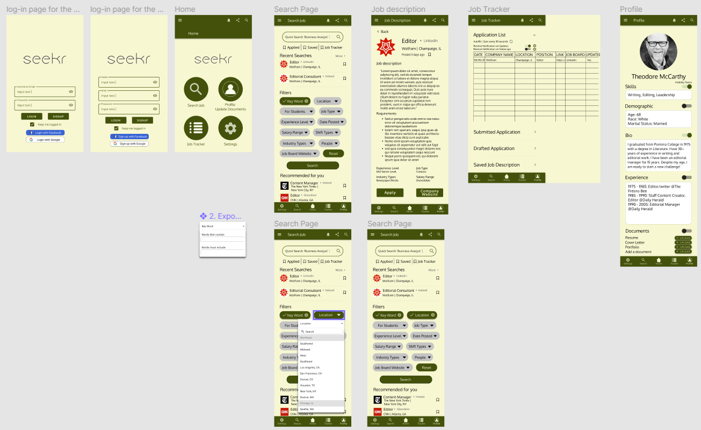
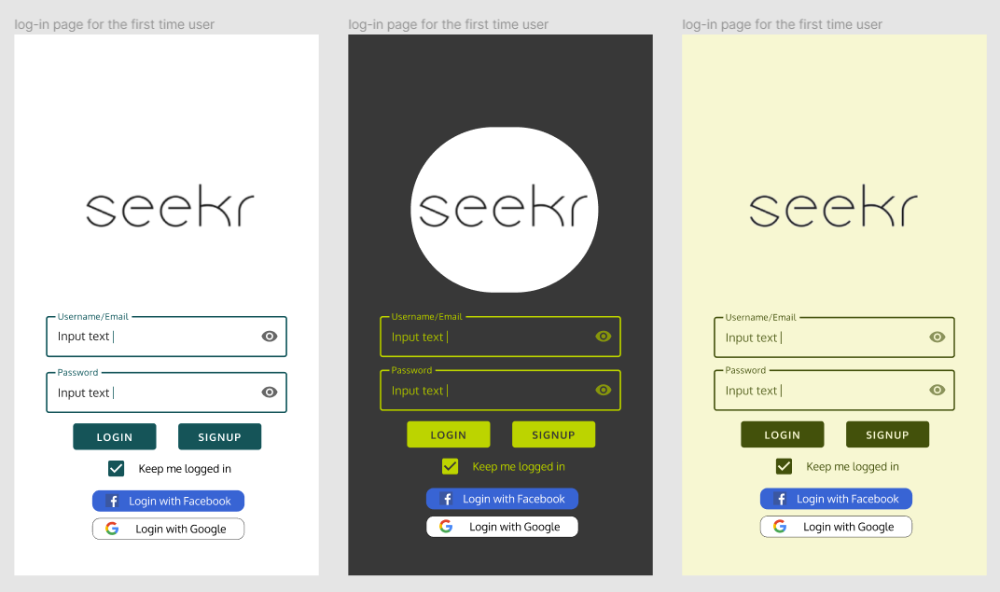
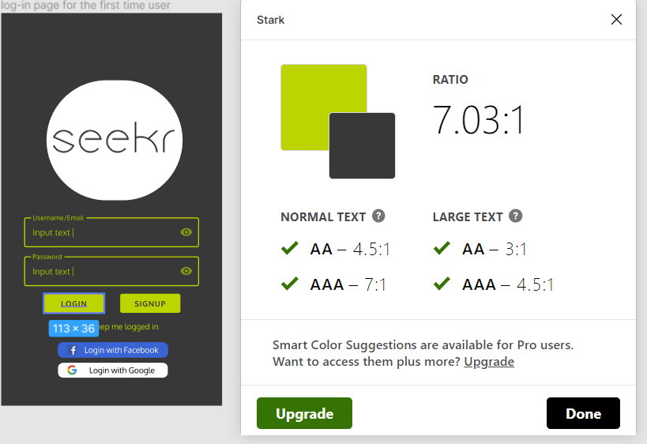
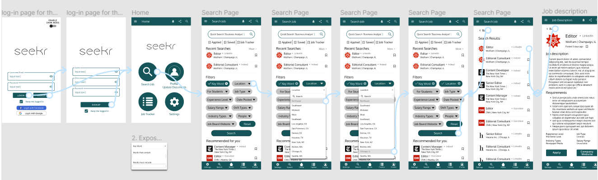
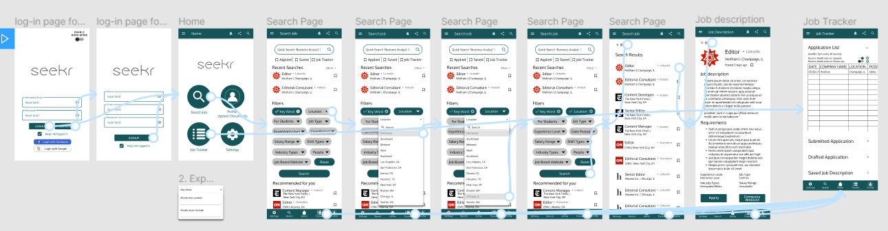
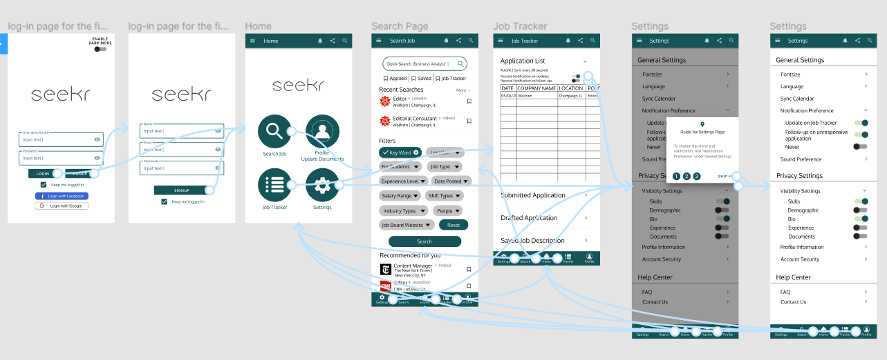
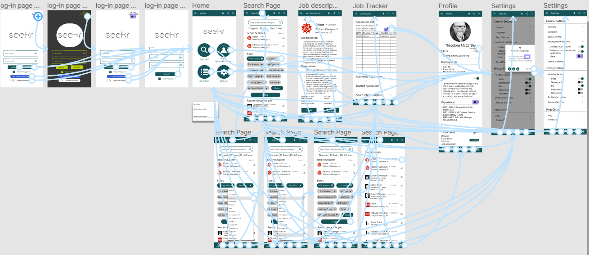

# Assignment 06 + 07 - Interface Design Part 1 + Part 2
## DH 110 Hana Yerin Lim

# Part 1
## Description 
The Seekr product is to provide more efficient ways to apply and keep track of their job applications by automatically generating the list of the job applications (job tracker) and uniting all the job postings that are from different websites. The purpose of a high-fidelity prototype is to finalize the visual design, improve the flow, and showcase the final design. 

### Process
Starting from the low-fidelity prototype, I first used the shapes to locate where each component should be. Then I input the details to make sure I get everything for the high-fidelity prototype. After finishing wireframing and prototyping from my end, I conducted a test with a participant to improve on my prototype and wireframe. This test helped me a lot in improving my design idea. Then I moved on to the high-fidelity prototype, in which I spent hours learning the appropriate buttons and components. I also got to learn more about colors as I did my wireframe. 

### Tasks 
The tasks that can be done through this product are the following: 
* Use the advanced filter to search jobs
* Decide on various job posting options from different websites 
* Apply to a certain job position 
* Check and manage the job tracker 
* Update profile information (documents (resume), bio, skills, experience updates) 
* Manage the notification preferences

## Screen Design 
### Screen Templates

### Design Variations 

## Impression Test
I conducted an impression test to three different participants. 

Participant 1
> "It seems like the usability of the product is well made, but something seems to be off. I'm not quite sure what it is, but I'm thinking it may be the combination of the color. The design feels outdated and old."

Participant 2
> "fresh, warming, innovative - new challenge because I haven't seen this color theme in other platform before, decent are the adjectives I can think of by looking at your product"  
> "One of the suggestions I can make is to make the default fontsize a bit smaller (because there will be an option to adjust the font in the settings). If you have time, try different types of fonts? It's not too bad right now but I think there could be a better font option."

Participant 3
> "I like this color scheme for the login pages, but like for the home page and the other ones i don't like it as much." "I think the white and turquoise color will look better"
> "It kinda reminds me of a forest and some yellow notepad"
> "The top bar on the home page looks too thick to me" 
> "and maybe the icons on that home page should have the same white-ish color", "the space before "For Students" isn't consistent with the other bubbles", "I'm not sure what is correct, but maybe these should be plural like "applications" or "descriptions". also in the profile page "demographics"" 
> "These buttons (upload document buttons on profile page) might be hard to click since they're small and close together. if there's a way to put more space between the buttons that would be good" "Or maybe just put a "add a document" and let them name it as "resume" or "cover letter" or have them click some checkbox saying what it is"

After talking to various people about my initial high-fidelity prototype, the most important thing I learned is that just because the colors I chose passed the assessibility check doesn't mean that it could be aesthetically pleasing. I am most likely going to make a slight change in color selection so that it could look nicer and less outdated. I initially thought my font choice would be good, but listening to other people's opinion made me realize this might not be the best choice. For an improvement, I will explore more font options and try to find the better font that matches will with my overall theme and design as well as apply othe suggestions. 

## Assessibility (Color-Contrast) Check 

 

## Design System 
### Typeface family + size
> Fonttype: Oxygen 
> * Subtitles: size 23
> * Regular fonts: size 19 
> * Job description: size 16
> * Option choices: size 13

### Color Scheme 
> Out of three different variations, I chose to work with the third screen. 
> * Background: #F7F8D3 (lighter yellow-green)
> * Buttons and tabs: #41520F (darker green)
> * Unselected filter: #C4C4C4 (grey)
> * Text: #F7F8D3 (For the buttons) #41520F (Log-in) #000000 (General) 

### Layout Grid + Spacing 
> * Used 4✕3 grid for log-in and sign-up pages - Since only the simple information was required from these two pages, 4✕3 grid was alright to use. 
> * Used 10✕9 grid for the Home page - Although this page was fairly simple with only the logo and four buttons, I decided to use 10✕9 grid, because smaller grids made it easier for me to align these buttons. 
> * Used 21✕9 grid for the Search page - I decided to go with the 21✕9 grid because there are so many information on the page that I thought smaller but more amount of grid might be helpful in this type of situation.

After applying many different types of fonts, I thought the font "Oxygen" matched the most with my theme. This font was the one that wasn't messy but not too stiff at the same time. I also decided my color scheme to be green, because I wanted to convey relaxed and comforting feeling to the users, who are the job seekers with the wide age groups. Both the font and the colors that I chose convey the feeling of comfort, and that is what I wanted to provide to all the job seekers who most of them would be stressed and anxious.
Just like previously mentioned, after getting suggestions from different participants, I decided to explore more font options to improve my design and will apply the suggestions to my next draft of high-fidelity prototype. 

# Part 2
##  Tasks 
1. Use the location filter to find the jobs that are located in Northeast and Chicago, IL. Then apply to the *Editor* position at Wolfram. (if you are on the job description page, your task is done.) 
2. After applying, check if the information is automatically listed in the job tracker. 
3. Make sure the notification is on for "Update on Job Tracker" and "Follow-up on unresponsive application". 

## Interactive Prototype 
Prototype link [here](https://www.figma.com/proto/n8RUJGab3htLzlLEhvTA3x/Untitled?node-id=75%3A0&scaling=min-zoom&page-id=0%3A1)

### Separate Prototypes: (optional|additional)
**Task 1:** 
 
https://www.figma.com/proto/AoDcE54NhtPMnF5PwQfd3Y/Untitled?node-id=1%3A879&scaling=min-zoom&page-id=0%3A1

**Task 2:**

https://www.figma.com/proto/FgvpG2V79ErYbrepida7t2/Untitled?node-id=1%3A3248&scaling=min-zoom&page-id=0%3A1

**Task 3:**

https://www.figma.com/proto/dBjCPFlAtiLIbgBWhaG5Br/Untitled?node-id=1%3A3248&scaling=min-zoom&page-id=0%3A1

## Wireflow

https://www.figma.com/file/n8RUJGab3htLzlLEhvTA3x/Prototype?node-id=0%3A1

## Cognitive Walkthrough 
Video recording can be found [here](https://drive.google.com/file/d/1VVawutvfa_ecXaTgJ3psAZU9HyMwkDWN/view?usp=sharing)

*The tester didn't want the video/voice recording so it only captures the screen*

**Task 1:** It took longer for her to find the "location" filter button, but other than that she had no problem reaching her goal.

**Task 2:** She hesitated for a moment but she eventually found the job tracker page and confirmed that the information is automatically updated. 

**Task 3:** She was able to reach the settings page and confirm that the notifications for "Update on Job Tracker" and "Follow-up on unresponsive application" are on. However, she kind of didn't understand the purpose of the switch on the settings page (difference between green and black buttons).

**What she liked about this product:** She appreciated how I considered every age groups by having bigger and readable fonts and buttons. 

**Possible improvements are discussed below** 

## Reflection 
First of all, I made some changes to the wireframe based on the previous comments and suggestions from the impression test participants. The wire flow and prototype on my end went pretty smoothly. I had the same tester, Asian & age group of 60-70, from last time to perform the given task on the high-fidelity prototype. Watching her finish the task, I once again got a lot of insight from my tester from this exercise. What I noticed is that her response time was much longer than I expected, and it took longer for her to search the certain keywords. Based on this, what I can do differently next time is to think of a better design that could increase the reaction rate for older people. I also learned that I would need to create the "back" button for every page for certain people, especially the older age groups. Although I have the "back" button on the search result and the job description pages, I noticed that my tester wanted to go back and seemed to be hesitant to go back to the previous page. From my perspective, I thought having the bar menu on the button would be enough, but that was not the case for my tester and her age group. In the future, I will consider making adjustments to creating the back button on every page. Lastly, In terms of the switches, I can add a guide on how the switch work in the textbox. I learned that endless thoughts, care, and tests from the participants are required to make a good product.
