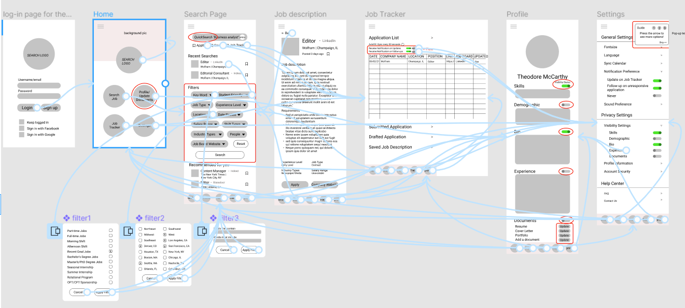
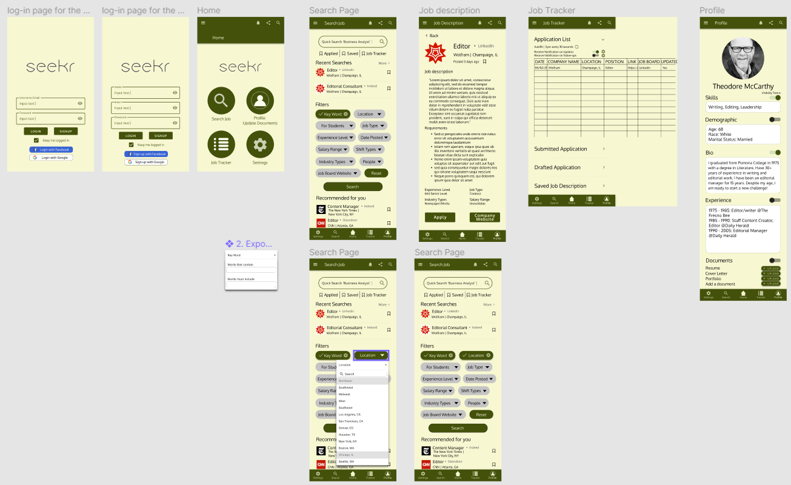

# Seekr: Easier Job Searching and Job Tracker App 
## DH 110 project by Hana Yerin Lim

### Introduction
The goal of thie project is to design a product that fulfills the users' efficiency with job hunting as they can be overwhelmed and be confused with loads of job applications on different types of job board websites and repeating information, and with job tracker as manually inputing the companies on google sheet could be burdensome. This project also aims to create a simple interface so that all the age groups, including the older generation, can use the product without much assistant and find the app easy to use. This project aims to organize and save the users time to be more productive and effective with their job application process. The goal of this project is to create a system that automatically organizes, manages, and keep track of the companies record. With some possible improvements on some of the issues, this new app/platform can satisfy the user's needs.

### Design statement
Most of the job seekers are tired of searching for available job positions out there and they probably have spent countless of time searching and filtering new opportunities. For this UX design project, I hope to provide an easy and simple interface for everyone to be able to use it without much guidance and for them to save a ton of time by making this product as a hub of so many online job boards with the automated job tracking feature.  

These are the three design features I have based on the user research: 

1. Advanced filters - More specified filters that includes more options for location (ex: west, south-west, east, etc), students (position for student/non-student), title and description (flexible and more advanced ways of including certain words). Platform that unites all the job board websites' job postings into this app/website so the user can get the latest and earliest possible updates
2. Personalized record - The automated list of the companies users applied organized and managed from the system; users can always come back to this list and refresh their memories on job descriptions or the date they applied
3. Follow-up Notification on application: if the company hasn't responded after a month, users receive a notification and can choose different possible options: either cold email the companies or discard that job application (cross out from the list).

### Competitor analysis: Heuristic Evaluation on LinkedIn
As the first step of the UX journey, I evaluated two of the competitor websites. I used the [Severity Ratings in Heuristic Evaluation: Nielson Norman Group](https://www.nngroup.com/articles/how-to-rate-the-severity-of-usability-problems/) and [10 Heuristics for User Interface Design: Nielson Normal Group](https://www.nngroup.com/articles/ten-usability-heuristics/) as the evaluation method. Similar to my topic and interest, I decided to make a further observation on **LinkedIn** and **Facebook** websites. The common theme of these two websites are networking, and LinkedIn is one of the most popular job boards. 

https://www.linkedin.com/

LinkedIn is an American business and employment-oriented online service that operates via websites and mobile apps. Launched on May 5, 2003, the platform is mainly used for professional networking and allows job seekers to post their CVs and employers to post jobs.

Overall Evaluation: Besides some of the strengths with the user experience components, The most critical problem with LinkedIn is the amount of error occurring more than half of the time when using the product. This bug needs to be fixed as soon as possible because no content nor a bad connection is the cause of the error. Another minor issue would be the inflexibility of withdrawing/undoing submitted applications. Some other competitive websites do have options to withdraw from the job position, which users might find helpful if they want to make any changes. Updates on the application process would be very helpful as the number of them is not shown. In addition to these major and minor points, more is discussed in the following table. 
  
[>> Read more about Heuristic Evaluation on Assignment 01](https://github.com/pioneer0317/DH110-HANALIM/tree/main/Assignments/Assignment%2001)

### Competitor analysis: Usability Testing on Facebook
Similar to one of LinkedIn's networking features, Facebook is one of the most popular global social networking services that operates via websites and mobile apps. The platform is mainly used for entertainment/socializing purposes and allows users to connect with friends through chat, groups, events, posts, and tag features. The users can also get entertained through various games and videos. With the recently added feature, users can also actively buy or sell the products through the Facebook marketplace.

Overall Evaluation: Some of the problems with Facebook's usability design are repetition, consistency, and recognition. Some tabs exist in several places from multiple navigation bars that end up navigating to the same page. (ex: "group" can be found on the left navigation bar, top navigation bar, and a plus dropdown menu on the top right corner.) Facebook needs to work on improving recommendation metrics. Facebook doesn't have a tags list that the users can choose to read or watch about a certain topic. For example, what I noticed is that whenever my friend tags me on a video, Facebook keeps recommending me similar types of videos that I am not interested to see. Although there is an option to stop suggesting this type of video, it somehow keeps popping up in my newsfeed as a suggested video. More is discussed in the following table.

### Usability Testing 
After conducting a heuristic evaluation on the Facebook website, several problems and concerns are addressed. First, Facebook doesn't have a good recommendation algorithm. It doesn't have an interest tags list for users to choose from, and it is not easy to change the video recommendation preference. Second, the aesthetic design of the website is very cluttered and overwhelming. Third, Facebook consistency is lacking as its design frequently changes when it introduces a new feature. Lastly, the efficiency lacks, as there are redundant tab options on different navigation bars, which can increase the user's dissatisfaction.

With these usability issues, I performed a usability test to find the factors that contribute to decreasing user satisfaction and the efficiency of using the website. The usability test intends to discover the flaws and improve on these points. The purpose of this session is to analyze user behavior for a potential improvement. In the test, a user is asked to complete a short series of tasks and describe his/her thought process.

After conducting a usability testing, there are several points I learned from the participant. Based on the participant's reaction, the biggest problem with the website is that it is unnecessarily complex, very cumbersome, there are too much inconsistencies, and not as easy to use as a social media platform. Although she said it is easy to use the platform now since she got used to it, she expressed that it might be hard for new users to learn how to use this website very quickly. The five words that the participant chose are boring, busy, familiar, old, and professional.

[>> Read more about the Usability Testing on Assignment 02](https://github.com/pioneer0317/DH110-HANALIM/tree/main/Assignments/Assignment%2002) 

### User research [contextual inquiry]
To get a better idea of creating a platform tailored to user's needs, I conducted an interview and participatory observation research with a friend who is part of the targeted demographic. The purpose of this user research is to get a better idea of the potential user demographic, their perspective and thoughts on the existing platforms and new idea. 
Here is the video of the interview with the participant. 

<iframe src="https://drive.google.com/file/d/1fOssZoGpLwAStUdFeNEblGfDfpbNXsKm/preview" width="640" height="480"></iframe>

[>> Read more on Assignment 03](https://github.com/pioneer0317/DH110-HANALIM/tree/main/Assignments/Assignment%2003)

### UX storytelling 
The purpose of UX storytelling is to get the opportunity to understand the user's emotion, behavior, thought process, and actions. This practice allows the developers to proceed with their designing process without the bias. When creating different personas, the designers can figure out the gain and the pain points, and find a way to make a product that is tailored to user's need. It is a great way to observe the situations and scenarios from their perspective, and get a better sense of how users act in certain types of conflicts and what they feel when they use the product.

For this project, I have created three personas. I have identified their goals, motivation, needs, challenges and frustrations, as well as their empathy map and the journey map to get a better idea of their thought process and the conversion. 

This is an example of Theodore's persona: 

<table>
<tr>
  <td>
     
  </td>
 
  <td>
     
  </td>
  
  <td>
     
  </td>
  </tr>
</table>

[>> Read the rest of the personas on Assignment 04](https://github.com/pioneer0317/DH110-HANALIM/tree/main/Assignments/Assignment%2004)

### Wireframe and graphic design element variation
For the color scheme, I chose green to be the main theme since the color blue was already used by LinkedIn platform. Initially, I chose to work with this color theme, but after going through an impression test with couple people, I decided to pivot my decision to the color theme on the right. 

<table>
<tr>
  <td>
     
  </td>
 
  <td>
     
  </td>
  </tr>
</table>

All of the variation passed the color-contrast ratio. 

[>> Check out the rest of the variation on Assignment 06](https://github.com/pioneer0317/DH110-HANALIM/tree/main/Assignments/Assignment%2006)

### Low-fidelity prototype 
After gathering insights from previous testings, these are the features that can mitigate the dissatisfaction and be geared towards a significant improvement.
1. Advanced filters - More specified filters that include more options for location (ex: west, south-west, east, etc), students (position for student/non-student), title and description (flexible and more advanced ways of including certain words). A platform that unites all the job board websites' job postings into this app/website so the user can get the latest and earliest possible updates
2. Personalized record - The automated list of the companies users applied organized and managed from the system; users can always come back to this list and refresh their memories on job descriptions or the date they applied
3. Follow-up Notification on application: If the company hasn't responded after a month, users receive a notification and can choose different possible options: either cold email the companies or discard that job application (cross out from the list).

For this exercise, I divided into 5 small steps to finish the low-fidelity prototype. 

**Wireframe 1st draft** 

**Wireframe 2nd draft** 

**Wireflow 1st draft** 

Based on the participant's feedback, I made the following changes on my final wireflow. 

**Wireflow final draft** 

[>> Read more on Assignment 05](https://github.com/pioneer0317/DH110-HANALIM/tree/main/Assignments/Assignment%2005)

### High-fidelity prototype (functional/interactive prototype)
Starting from the low-fidelity prototype, I first used the shapes to locate where each component should be. Then I input the details to make sure I get everything for the high-fidelity prototype. After finishing wireframing and prototyping from my end, I conducted a test with a participant to improve on my prototype and wireframe. This test helped me a lot in improving my design idea. Then I moved on to the high-fidelity prototype, in which I spent hours learning the appropriate buttons and components. I also got to learn more about colors as I did my wireframe.

**Wireframe 1st draft** 

**Prototype** 
<iframe style="border: 1px solid rgba(0, 0, 0, 0.1);" width="800" height="450" src="https://www.figma.com/embed?embed_host=share&url=https%3A%2F%2Fwww.figma.com%2Fproto%2Fn8RUJGab3htLzlLEhvTA3x%2FPrototype%3Fnode-id%3D75%253A0%26scaling%3Dscale-down%26page-id%3D0%253A1" allowfullscreen></iframe>

[>> Read more on Assignment 06](https://github.com/pioneer0317/DH110-HANALIM/tree/main/Assignments/Assignment%2006)

### Optional evaluation and revision history 
Including cognitive walkthrough; impression test, accessibility audit, usability testing), per each summary and link to the notes (when you share the video or other detailed evidences, I will notify you when you can make the contents private as soon as your work is graded)

### Pitch video 

### Conclusion

<table>
<tr>
  <td> </td>
 
  <td>

  </td>
  </tr>
</table>
