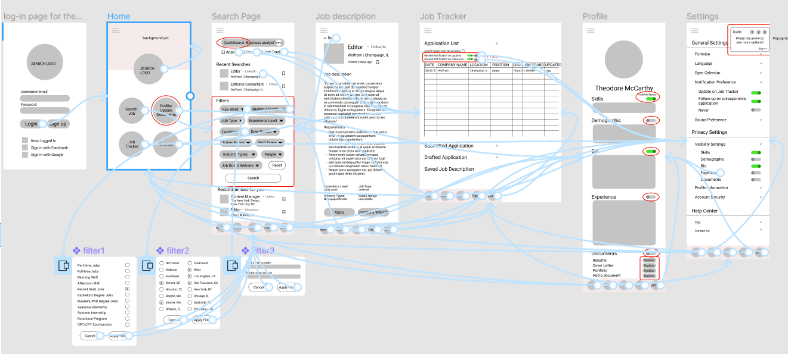
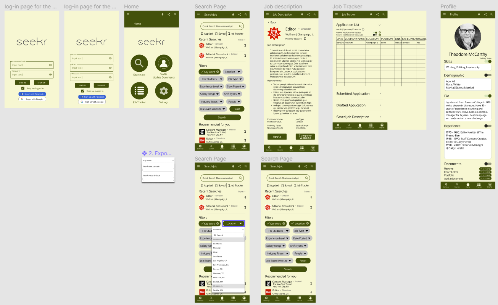

# Seekr: Easier Job Searching and Job Tracker App 
## DH 110 project by Hana Yerin Lim

### Introduction
The goal of this project is to design a product that fulfills the users' efficiency with job hunting and job tracking. Job hunting can be overwhelming and confusing when there are loads of job applications and repeating information on different job board websites. Manually tracking and inputting the companies on google sheets could be burdensome. This project also aims to create a simple interface so that all the age groups, including the older generation, can use the product without many assistants and find the app easy to use. This product will automatically organize, manage, and record the company information. With some possible improvements on some of the issues, this new app/platform can satisfy the user's needs.

### Design statement
Most of the job seekers are tired of searching for available job positions out there and they probably have spent countless of time searching and filtering new opportunities. For this UX design project, I hope to provide an easy and simple interface for everyone to be able to use it without much guidance and save a ton of time by making this product as a hub of so many online job boards with the automated job tracking feature.  

These are the three design features I have based on the user research: 

1. Advanced filters - More specified filters that includes more options for location (ex: west, south-west, east, etc), students (position for student/non-student), title and description (flexible and more advanced ways of including certain words). Platform that unites all the job board websites' job postings into this app/website so the user can get the latest and earliest possible updates
2. Personalized record - The automated list of the companies users applied organized and managed from the system; users can always come back to this list and refresh their memories on job descriptions or the date they applied
3. Follow-up Notification on application: if the company hasn't responded after a month, users receive a notification and can choose different possible options: either cold email the companies or discard that job application (cross out from the list).

### Competitor analysis: Heuristic Evaluation on LinkedIn and Facebook 
As the first step of the UX journey, I evaluated two of the competitor websites. I used the [Severity Ratings in Heuristic Evaluation: Nielson Norman Group](https://www.nngroup.com/articles/how-to-rate-the-severity-of-usability-problems/) and [10 Heuristics for User Interface Design: Nielson Normal Group](https://www.nngroup.com/articles/ten-usability-heuristics/) as the evaluation method. Similar to my topic and interest, I decided to make a further observation on **LinkedIn** and **Facebook** websites. The common theme of these two websites are networking, and LinkedIn is one of the most popular job boards. 

<table>
<tr>
  <td>
     
  </td>
  <td>
     
  </td>
  </tr>
</table>

**LinkedIn** is an American business and employment-oriented online service that operates via websites and mobile apps. Launched on May 5, 2003, the platform is mainly used for professional networking and allows job seekers to post their CVs and employers to post jobs.

Overall Evaluation: Besides some of the strengths with the user experience components, The most critical problem with LinkedIn is the amount of error occurring more than half of the time when using the product. This bug needs to be fixed as soon as possible because no content nor a bad connection is the cause of the error. Another minor issue would be the inflexibility of withdrawing/undoing submitted applications. Some other competitive websites do have options to withdraw from the job position, which users might find helpful if they want to make any changes. Updates on the application process would be very helpful as the number of them is not shown. In addition to these major and minor points, more is discussed in the following table. 
  
Similar to one of LinkedIn's networking features, **Facebook** is one of the most popular global social networking services that operates via websites and mobile apps. The platform is mainly used for entertainment/socializing purposes and allows users to connect with friends through chat, groups, events, posts, and tag features. The users can also get entertained through various games and videos. With the recently added feature, users can also actively buy or sell the products through the Facebook marketplace.

Overall Evaluation: Some of the problems with Facebook's usability design are repetition, consistency, and recognition. Some tabs exist in several places from multiple navigation bars that end up navigating to the same page. (ex: "group" can be found on the left navigation bar, top navigation bar, and a plus dropdown menu on the top right corner.) Facebook needs to work on improving recommendation metrics. Facebook doesn't have a tags list that the users can choose to read or watch about a certain topic. For example, what I noticed is that whenever my friend tags me on a video, Facebook keeps recommending me similar types of videos that I am not interested to see. Although there is an option to stop suggesting this type of video, it somehow keeps popping up in my newsfeed as a suggested video. More is discussed in the following table.

[>> Read more about Heuristic Evaluation on Assignment 01](https://github.com/pioneer0317/DH110-HANALIM/tree/main/Assignments/Assignment%2001)

### Usability Testing 
After conducting a heuristic evaluation on the Facebook website, several problems and concerns are addressed. First, Facebook doesn't have a good recommendation algorithm. It doesn't have an interest tags list for users to choose from, and it is not easy to change the video recommendation preference. Second, the aesthetic design of the website is very cluttered and overwhelming. Third, Facebook consistency is lacking as its design frequently changes when it introduces a new feature. Lastly, the efficiency lacks, as there are redundant tab options on different navigation bars, which can increase the user's dissatisfaction.

With these usability issues, I performed a usability test to find the factors that contribute to decreasing user satisfaction and the efficiency of using the website. The usability test intends to discover the flaws and improve on these points. The purpose of this session is to analyze user behavior for a potential improvement. In the test, a user is asked to complete a short series of tasks and describe his/her thought process.

After conducting a usability testing, there are several points I learned from the participant. Based on the participant's reaction, the biggest problem with the website is that it is unnecessarily complex, very cumbersome, there are too much inconsistencies, and not as easy to use as a social media platform. Although she said it is easy to use the platform now since she got used to it, she expressed that it might be hard for new users to learn how to use this website very quickly. The five words that the participant chose are boring, busy, familiar, old, and professional.

The usabiliy test recording can be found [here](https://drive.google.com/file/d/1fOssZoGpLwAStUdFeNEblGfDfpbNXsKm/view?usp=sharing)

[>> Read more about the Usability Testing on Assignment 02](https://github.com/pioneer0317/DH110-HANALIM/tree/main/Assignments/Assignment%2002) 

### User research [contextual inquiry]
To get a better idea of creating a platform tailored to user's needs, I conducted an interview and participatory observation research with a friend who is part of the targeted demographic. The purpose of this user research is to get a better idea of the potential user demographic, their perspective and thoughts on the existing platforms and new idea. 
Here is the video of the interview with the participant. 

It was a great opportunity to observe the same questions from other person's perspective. I realized even the basic questions we saw them through different lenses. During the interview, my interviewee suggested a brilliant idea about the filter features from the job boards. His suggestion was to have a "student-friendly" option, which will allow students to not waste time on seeing the jobs with "weekday or overnight" descriptions. The interviewee also claimed that the current students seeking internships, recent grads, and any job seekers seeking full-time opportunities would find the idea of having a "job tracking" system extremely helpful. In this way, they wouldn't have to manually put down the information of the companies they've applied to. He also mentioned that it would be more approachable to him to be more active in applying if he knew there was such a system. 

The recording of the interview can be found [here](https://drive.google.com/file/d/1QcRcb32k_MZJPRig5qN9PeuScWuUFTdi/view?usp=sharing)

[>> Read more on Assignment 03](https://github.com/pioneer0317/DH110-HANALIM/tree/main/Assignments/Assignment%2003)

### UX storytelling 
After conducting a usability test, user research, and competitor analysis, I created three different personas based on these previous experience. I have identified their goals, motivation, needs, challenges and frustrations, as well as their empathy map and the journey map to get a better idea of their thought process and the conversion. The purpose of UX storytelling is to get the opportunity to understand the user's emotion, behavior, thought process, and actions. This practice allows the developers to proceed with their designing process without the bias. When creating different personas, the designers can figure out the gain and the pain points, and find a way to make a product that is tailored to user's need. It is a great way to observe the situations and scenarios from their perspective, and get a better sense of how users act in certain types of conflicts and what they feel when they use the product.

This is an example of Theodore's persona: 

[>> Read the rest of the personas on Assignment 04](https://github.com/pioneer0317/DH110-HANALIM/tree/main/Assignments/Assignment%2004)

### Wireframe and graphic design element variation
Getting into a design perspective of the project, I decided to use green as the main theme since the color blue was already used by LinkedIn platform. I also wanted the users to feel less stressed as they already are. Initially, I chose to work with the third color theme, but after going through an impression test with couple people, I decided to pivot my decision to the first color scheme. 

 

All of the variation passed the color-contrast ratio. 

[>> Check out the rest of the variation on Assignment 06](https://github.com/pioneer0317/DH110-HANALIM/tree/main/Assignments/Assignment%2006)

### Low-fidelity prototype 
After gathering insights from previous testings, these are the features that can mitigate the dissatisfaction and be geared towards a significant improvement. The purpose of the low-fidelity prototype is to test the functionality and the flow of the features and to check if the features are tailored to the user's needs. 

On top of the key features, the following tasks are tested by the participant for the low-fidelity prototype: 
1. Filter location, keyword, and student-friendly to search a job
2. After applying, check if the information is automatically listed in the job tracker
3. Select skills and bio to show on the user’s profile
4. Update the resume
5. Change the follow-up notification from unresponsive companies

For this exercise, I divided into 5 small steps to finish the low-fidelity prototype. [The full version can be found in Assignment 05](https://github.com/pioneer0317/DH110-HANALIM/tree/main/Assignments/Assignment%2005)

Based on the tester's feedback, I changed and added a few spots to make a better and more usable product. The things I changed are:

Clarify the titles - profile/documents into profile/update documents, Search into Quick search
Arrange the filters in the order of most frequently used
Add the ability to control the visibility status on each Bio and Job Tracker pages
Add update buttons next to each document instead of clicking the words
Add textboxes for the tips and guides - if the user chooses not to get the guide, there is an option to skip

**Wireflow final draft** 

This was a great exercise for me to observe and think from a wider perspective. I would try to think more from the older age group perspective so that the product can be beginner-friendly to not just the younger age groups but also the older age groups. I liked that I could be creative with designing the functionality of the product. To be honest, at first, when I did the wireframing and prototyping, I thought I got every detail and felt like this low-fidelity would be in a good shape, ready to move on to the next stage. However, once the tester worked on the given tasks to test the product, I realized there was so much to improve. Most of all, I had a tester with an older age group this time, which I got to learn how they thought of the technology and how easier I could design the product to satisfy all the age group's experiences.

### High-fidelity prototype (functional/interactive prototype)
Incorporating everything that I've learned from each process, I built a high-fidelity prototype. Starting from the low-fidelity prototype, I first used the shapes to locate where each component should be. Then I input the details to make sure I get everything for the high-fidelity prototype. After finishing wireframing and prototyping from my end, I conducted a test with a participant to improve on my prototype and wireframe. This test helped me a lot in improving my design idea. Then I moved on to the high-fidelity prototype, in which I spent hours learning the appropriate buttons and components. I also got to learn more about colors as I did my wireframe.

**Initial screen design** 

Initially I used the olive and yellow color theme, but after conducting an impression test with couple of other people, I changed the theme into white and teal color theme. 

**Wireframe** 

**High-fidelity prototype** 

<iframe style="border: 1px solid rgba(0, 0, 0, 0.1);" width="800" height="450" src="https://www.figma.com/embed?embed_host=share&url=https%3A%2F%2Fwww.figma.com%2Fproto%2Fn8RUJGab3htLzlLEhvTA3x%2FPrototype%3Fnode-id%3D75%253A0%26scaling%3Dscale-down%26page-id%3D0%253A1" allowfullscreen></iframe>

[>> Read more on Assignment 06](https://github.com/pioneer0317/DH110-HANALIM/tree/main/Assignments/Assignment%2006)

### Evaluation and revision history 
#### Impression Test
After talking to various people about my initial high-fidelity prototype, the most important thing I learned is that just because the colors I chose passed the assessibility check doesn't mean that it could be aesthetically pleasing, and this is how I decided to use a teal color theme. I also applied some changes on the wireframe based on the participants' suggestions on design. 

#### Cognitive Walkthrough 
My classmates suggested several points: For the selected filter, the fonts could be in bold to be distinguished; have different logos for apply, saved, and job tracker; fix the navigation tab to stay still 

What I noticed from the participant (elder woman) is that her response time was much longer than I expected, and it took longer for her to search the certain keywords. Based on this, what I can do differently next time is to think of a better design that could increase the reaction rate for older people. I also learned that I would need to create the "back" button for every page for certain people, especially the older age groups. Although I have the "back" button on the search result and the job description pages, I noticed that my tester wanted to go back and seemed to be hesitant to go back to the previous page. From my perspective, I thought having the bar menu on the button would be enough, but that was not the case for my tester and her age group. In the future, I will consider making adjustments to creating the back button on every page. Lastly, In terms of the switches, I can add a guide on how the switch work in the textbox.

[Read full evaluation and revision history in assignment 06](https://github.com/pioneer0317/DH110-HANALIM/tree/main/Assignments/Assignment%2006)

### Pitch video 
<iframe width="840 height="480" src="https://drive.google.com/file/d/1m1ePrFIbS1aWsNEUC49Rfj58rW6GHN7z/view?usp=sharing"></iframe>

[Pitch video can be found here](https://drive.google.com/file/d/1m1ePrFIbS1aWsNEUC49Rfj58rW6GHN7z/view?usp=sharing) 

### Conclusion
This was my first time learning about the full process of user experience design. Each process of the user experience design was very thorough and in-depth. Because of this experience, I was able to understand how the user research and low-fidelity prototyping is as important as the aesthetic part of the design. From the competitor analysis, it was a time that I evaluated the very familiar and well-known competitor websites. This allowed me to rethink and analyze about the problem and inconveniency of the existing solution. During the usability testing and an interview, I was able to listen to different person's thought process and approach on the same issue. Then, I created three personas based on the insights I've gathered from the participants. User personas allowed me to organize my thought on how I would proceed with the product design. By letting the tester to perform some tasks on my low fidelity prototype, I learned how the different generations perceive things differently, which gave me a significant effect on my thought on the design interface. Lastly, I got a lot of good feedbacks from different participants from the high-fidelity prototype so I had a lot of room to make an improvement with my design. I learned that endless thoughts, care, and tests from the participants are required to make a good product.

